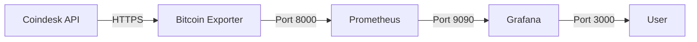

# 📊 Bitcoin Price Monitor

[](https://github.com/yourusername/devops-test/actions)
[](https://hub.docker.com/)
[](https://kubernetes.io/)
[](LICENSE)

A production-ready Bitcoin price monitoring solution using Prometheus and Grafana, built with DevOps best practices.

## 🚀 Features

- **Real-time Bitcoin Price Monitoring** - Fetches current BTC price from Coindesk API
- **Prometheus Metrics Export** - Exposes metrics in Prometheus format
- **Grafana Dashboards** - Beautiful visualizations with 6-hour historical data
- **Error Tracking** - Comprehensive error metrics and success indicators
- **Multi-deployment Support** - Docker Compose and Kubernetes ready
- **Production Ready** - Health checks, graceful shutdown, retry mechanisms
- **Secure by Default** - Non-root container user, resource limits
- **Fully Tested** - Unit tests with >70% coverage

## 📋 Prerequisites

- Docker Desktop or Docker Engine
- Python 3.11+ (for local development)
- (Optional) Minikube or Rancher Desktop for Kubernetes deployment

## 🏃‍♂️ Quick Start

### Using the Setup Script (Recommended)

```bash
# Start with Docker Compose
python setup.py --docker

# OR start with Kubernetes (Minikube)
python setup.py --minikube

# Cleanup
python setup.py --clean
```

### Manual Docker Compose

```bash
cd docker
docker-compose up -d --build
```

## 📦 Access Points

After deployment, access the services at:

| Service | URL | Credentials |
|---------|-----|-------------|
| **Bitcoin Metrics** | http://localhost:8000/metrics | N/A |
| **Prometheus** | http://localhost:9090 | N/A |
| **Grafana** | http://localhost:3000 | admin/admin (or anonymous) |

## 🏗️ Architecture



### Components

1. **Bitcoin Exporter** - Python application that:
   - Queries Coindesk API every 60 seconds
   - Exposes metrics on port 8000
   - Handles retries and errors gracefully

2. **Prometheus** - Time-series database that:
   - Scrapes metrics from the exporter
   - Stores historical data
   - Provides query interface

3. **Grafana** - Visualization platform that:
   - Displays real-time Bitcoin prices
   - Shows 6-hour historical trends
   - Auto-provisions dashboards

## 🧪 Testing

Run the comprehensive test suite:

```bash
# Run all tests with coverage
make test

# Run specific test file
pytest tests/test_coindesk_provider.py -v

# Run with coverage report
pytest --cov=exporter/src --cov-report=html
```

### Test Coverage Areas

- ✅ Coindesk API provider
- ✅ Bitcoin metric collector
- ✅ Configuration loader
- ✅ Error handling
- ✅ Retry mechanisms

## 🚢 Deployment Options

### Docker Compose (Development)

```bash
# Start services
python setup.py --docker

# Access services
# Grafana:    http://localhost:3000
# Prometheus: http://localhost:9090
# Exporter:   http://localhost:8000/metrics

# Stop services
python setup.py --clean
```

### Kubernetes (Minikube) - Stage 1: Port-Forwarding

```bash
# Deploy to Kubernetes
python setup.py --minikube

# Port-forward services (in separate terminals)
kubectl port-forward -n bitcoin-monitoring svc/prometheus 9090:9090
kubectl port-forward -n bitcoin-monitoring svc/grafana 3000:3000

# Access services
# Grafana:    http://localhost:3000
# Prometheus: http://localhost:9090

# Useful commands
kubectl get pods -n bitcoin-monitoring
kubectl logs -n bitcoin-monitoring -l app=bitcoin-exporter

# Cleanup
python setup.py --clean
```

## 📊 Metrics Exposed

| Metric | Type | Description | Labels |
|--------|------|-------------|--------|
| `bitcoin_price` | Gauge | Current Bitcoin price in USD | currency, source |
| `bitcoin_price_last_updated` | Gauge | Timestamp of last price update | - |
| `bitcoin_price_errors_total` | Counter | Total number of fetch errors | error_type |
| `bitcoin_price_fetch_success` | Gauge | Last fetch success status (1/0) | - |

## 🔧 Configuration

Configuration is managed through YAML files in the `config/` directory:

- `app-config.yaml` - Main application configuration
- `environments/` - Environment-specific overrides
- `metrics.yaml` - Metric definitions
- `labels.yaml` - Label configurations

### Environment Variables

Copy `.env.example` to `.env` and customize:

```bash
ENV=local
LOG_LEVEL=INFO
EXPORTER_PORT=8000
```

## 🛠️ Development

### Project Structure

```
├── exporter/           # Python Bitcoin price exporter
│   ├── src/           # Source code
│   │   ├── collectors/ # Metric collectors
│   │   ├── providers/  # API providers
│   │   └── config/     # Configuration management
│   ├── Dockerfile     # Multi-stage Docker build
│   └── requirements.txt
├── docker/            # Docker Compose setup
├── k8s/               # Kubernetes manifests
├── config/            # Application configuration
├── dashboards/        # Grafana dashboards
├── tests/             # Unit tests
├── scripts/           # Utility scripts
└── setup.py           # Automated setup script
```

### Adding New Providers

1. Create a new provider class in `exporter/src/providers/`
2. Inherit from `BaseProvider`
3. Implement required methods: `fetch_data()` and `parse_response()`
4. Update configuration to use new provider

### Code Quality

```bash
# Format code
make format

# Run linting
make lint

# Type checking
mypy exporter/src
```

## 📈 CI/CD Pipeline

The project includes a complete GitHub Actions workflow that:

1. **Tests** - Runs unit tests and coverage
2. **Linting** - Checks code quality
3. **Security Scan** - Vulnerability scanning with Trivy
4. **Build** - Creates Docker image
5. **Deploy** - (On release) Deploys to Docker Hub and Kubernetes

## 🔒 Security Features

- Non-root container user (UID 1000)
- Resource limits enforced
- Health checks and readiness probes
- No hardcoded secrets
- Vulnerability scanning in CI/CD

## 🐛 Troubleshooting

### Common Issues

1. **TLS/Network Errors**
   ```bash
   # The setup script now includes retry mechanisms
   python setup.py --docker
   ```

2. **Port Conflicts**
   ```bash
   # Check if ports are in use
   netstat -an | grep -E "8000|9090|3000"
   
   # Change ports in docker-compose.yml or .env
   ```

3. **Grafana Dashboard Not Loading**
   ```bash
   # Check Grafana logs
   docker-compose -f docker/docker-compose.yml logs grafana
   
   # Restart Grafana
   docker-compose -f docker/docker-compose.yml restart grafana
   ```

## 📝 License

This project is licensed under the MIT License - see the [LICENSE](LICENSE) file for details.

## 🤝 Contributing

1. Fork the repository
2. Create a feature branch (`git checkout -b feature/amazing-feature`)
3. Commit changes (`git commit -m 'Add amazing feature'`)
4. Push to branch (`git push origin feature/amazing-feature`)
5. Open a Pull Request

## 📞 Support

For issues or questions:
- Open an issue on GitHub
- Check existing issues for solutions
- Review the [documentation](docs/)

## 🙏 Acknowledgments

- [Coindesk API](https://www.coindesk.com/coindesk-api) for Bitcoin price data
- [Prometheus](https://prometheus.io/) for metrics collection
- [Grafana](https://grafana.com/) for visualization
- The open-source community

---

Built with ❤️ for the DevOps community
